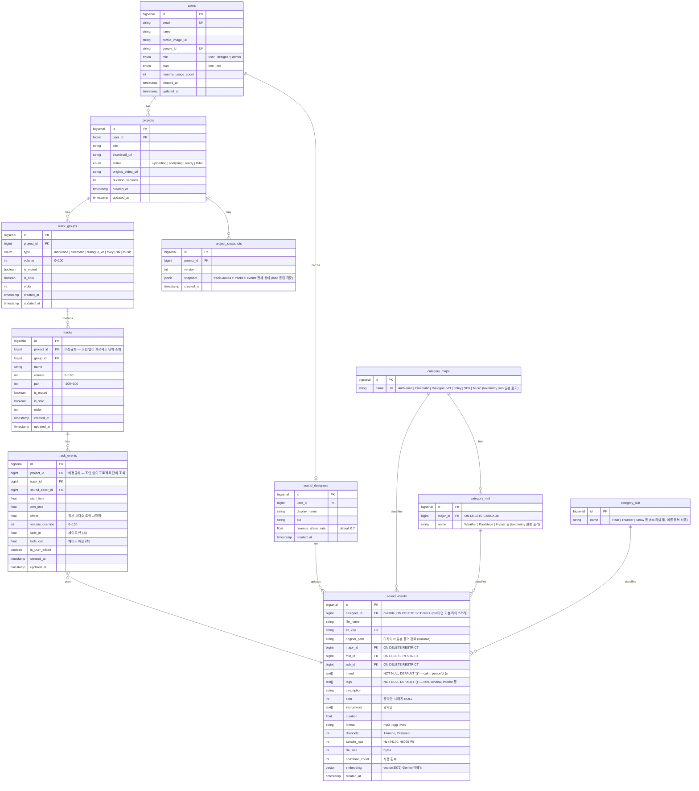

# ERD (Entity Relationship Diagram)

## 1. 테이블 구조 (Mermaid)



---

## 2. 테이블 설명

### users
사용자 계정 정보. Google OAuth로 가입/로그인 처리.

| 컬럼 | 타입 | 설명 |
|------|------|------|
| id | BIGSERIAL | PK |
| email | VARCHAR | Google 계정 이메일 (unique) |
| name | VARCHAR | 표시 이름 |
| profile_image_url | VARCHAR | Google 프로필 이미지 URL |
| google_id | VARCHAR | Google 고유 ID (unique) |
| role | ENUM | user / designer / admin |
| plan | ENUM | free / pro |
| monthly_usage_count | INT | 당월 프로젝트 생성 수 (무료 플랜 제한용) |
| created_at | TIMESTAMP | 가입일 |
| updated_at | TIMESTAMP | 정보 수정일 |

### projects
사용자가 생성한 영상 프로젝트.

| 컬럼 | 타입 | 설명 |
|------|------|------|
| id | BIGSERIAL | PK |
| user_id | BIGINT | FK → users |
| title | VARCHAR | 프로젝트 이름 |
| thumbnail_url | VARCHAR | 프로젝트 썸네일 (영상 첫 프레임 등) |
| status | ENUM | 처리 상태 (uploading / analyzing / ready / failed) |
| original_video_url | VARCHAR | 원본 영상 파일 경로 |
| duration_seconds | INT | 영상 길이 (초) |
| created_at | TIMESTAMP | 생성일 |
| updated_at | TIMESTAMP | 수정일 |

### track_groups
트랙 대분류 그룹. 프로젝트 생성 시 6개 자동 생성됨.

| 컬럼 | 타입 | 설명 |
|------|------|------|
| id | BIGSERIAL | PK |
| project_id | BIGINT | FK → projects |
| type | ENUM | ambience / cinematic / dialogue_vo / foley / sfx / music |
| volume | INT | 그룹 전체 볼륨 (0 ~ 100) |
| is_muted | BOOLEAN | 그룹 뮤트 상태 |
| is_solo | BOOLEAN | 그룹 솔로 상태 |
| order | INT | 에디터 표시 순서 |
| created_at | TIMESTAMP | 생성일 |
| updated_at | TIMESTAMP | 수정일 |

### tracks
그룹 하위의 개별 트랙. 하나의 그룹 안에 여러 트랙이 존재할 수 있음.

| 컬럼 | 타입 | 설명 |
|------|------|------|
| id | BIGSERIAL | PK |
| project_id | BIGINT | FK → projects (비정규화) |
| group_id | BIGINT | FK → track_groups |
| name | VARCHAR | 트랙 이름 |
| volume | INT | 트랙 볼륨 (0 ~ 100) |
| pan | INT | 좌우 패닝 (-100 ~ 100, 0이 중앙) |
| is_muted | BOOLEAN | 트랙 뮤트 상태 |
| is_solo | BOOLEAN | 트랙 솔로 상태 |
| order | INT | 그룹 내 표시 순서 |
| created_at | TIMESTAMP | 생성일 |
| updated_at | TIMESTAMP | 수정일 |

### track_events
각 트랙에 배치된 효과음 이벤트 (AI 결과 + 사용자 편집 내용).

| 컬럼 | 타입 | 설명 |
|------|------|------|
| id | BIGSERIAL | PK |
| project_id | BIGINT | FK → projects (비정규화) |
| track_id | BIGINT | FK → tracks |
| sound_asset_id | BIGINT | FK → sound_assets, **ON DELETE RESTRICT** (사용 중 에셋 삭제 차단) |
| start_time | FLOAT | 효과음 시작 시간 (초) |
| end_time | FLOAT | 효과음 종료 시간 (초) |
| offset | FLOAT | 원본 오디오 트림 시작점 (초) |
| volume_override | INT | 이벤트 개별 볼륨 오버라이드 (0 ~ 100) |
| fade_in | FLOAT | 페이드 인 길이 (초) |
| fade_out | FLOAT | 페이드 아웃 길이 (초) |
| is_user_edited | BOOLEAN | 사용자가 수동 편집했는지 여부 |
| created_at | TIMESTAMP | 생성일 |
| updated_at | TIMESTAMP | 수정일 |

### project_snapshots
프로젝트 편집 히스토리. 버전별 전체 상태를 JSON으로 저장.

| 컬럼 | 타입 | 설명 |
|------|------|------|
| id | BIGSERIAL | PK |
| project_id | BIGINT | FK → projects |
| version | INT | 스냅샷 버전 번호 |
| snapshot | JSONB | trackGroups > tracks > events 중첩 구조 (load 응답 기준) |
| created_at | TIMESTAMP | 생성일 |

#### snapshot JSON 스키마 (load 응답 기준)
`GET /api/projects/:id/load`의 `snapshot` 필드와 동일한 구조. 복원 시 이 JSON을 그대로 track_groups / tracks / track_events 테이블에 치환 삽입.

```jsonc
{
  "version": 1,
  "trackGroups": [
    {
      "id": 1,                    // 복원 시 재발급 (참고용)
      "type": "ambience",
      "volume": 80,
      "isMuted": false,
      "isSolo": false,
      "order": 1,
      "tracks": [
        {
          "id": 1,
          "name": "Ambience 1",
          "volume": 100,
          "pan": 0,
          "isMuted": false,
          "isSolo": false,
          "order": 1,
          "events": [
            {
              "id": 1,
              "soundAssetId": 101,
              "startTime": 0.0,
              "endTime": 15.5,
              "offset": 0.0,
              "volumeOverride": 80,
              "fadeIn": 0.5,
              "fadeOut": 1.0,
              "isUserEdited": false
            }
          ]
        }
      ]
    }
  ]
}
```

> 복원 정책: 저장된 id는 참고용. 복원 시 track_groups / tracks / track_events를 project_id 기준 전체 삭제 후 스냅샷 JSON을 순회하며 신규 PK로 재삽입 (`saveProject`의 replace 전략과 동일).

### category_major / category_mid / category_sub
효과음 3단계 분류 체계 (대분류 → 중분류 → 소분류). 전 단계 NOT NULL.
원천 데이터는 `ai/taxonomy.json`이며, 이름은 **taxonomy 원본 표기**(`Ambience`, `Dialogue_VO`, `SFX`, `UI`, `Slam` 등)를 그대로 저장한다. `track_group_type` enum(소문자)과는 앱 레이어에서 매핑.

| 테이블 | 컬럼 | 타입 | 설명 |
|--------|------|------|------|
| category_major | id | BIGSERIAL | PK |
| | name | VARCHAR(50) | 대분류. **UNIQUE**. 6개: Ambience / Cinematic / Dialogue_VO / Foley / SFX / Music |
| category_mid | id | BIGSERIAL | PK |
| | major_id | BIGINT | FK → category_major, **ON DELETE CASCADE** |
| | name | VARCHAR(50) | 중분류. **UNIQUE (major_id, name)** — 같은 대분류 하위에서만 유일 |
| category_sub | id | BIGSERIAL | PK |
| | name | VARCHAR(50) | 소분류. **flat 라벨 풀 — 이름 중복 허용** (예: Metal/Wood/Dark 등 맥락별 변형 id) |

> **category_sub가 flat인 이유**: JSONL 원천 데이터에서 sub는 mid의 child가 아니라 독립적 라벨 축이다. 동일한 sub(예: `Slam` = id 174)이 여러 mid(`Impact`, `UI`, `Explosion` 등) 아래 등장한다. 따라서 `category_sub.mid_id` FK를 두지 않고 전역 id 풀로 관리한다. `sound_assets`에는 `(major_id, mid_id, sub_id)` 3개 FK가 **독립적**으로 붙는다.

> **ID 고정 전략**: `taxonomy.json` 선언 순서대로 INSERT하면 BIGSERIAL이 부여하는 id가 `sound_assets_*.jsonl`의 `major_id / mid_id / sub_id`와 정확히 일치한다 (검증: SFX=5, SFX/UI=45, SFX/Impact/Slam=174). seed 이후 `setval('category_*_id_seq', MAX(id))`로 시퀀스 보정.

### sound_assets
효과음 파일 메타데이터. 기본 라이브러리 + 마켓플레이스 에셋 모두 포함.

| 컬럼 | 타입 | 설명 |
|------|------|------|
| id | BIGSERIAL | PK |
| designer_id | BIGINT | FK → sound_designers, **ON DELETE SET NULL** (null이면 기본 라이브러리) |
| file_name | VARCHAR | 파일 이름 |
| s3_key | VARCHAR | S3 저장 경로, **UNIQUE** |
| original_path | VARCHAR | 디자이너 업로드 시 원본 폴더 경로 (nullable, 트리 복원용) |
| major_id | BIGINT | FK → category_major (NOT NULL, **ON DELETE RESTRICT**) |
| mid_id | BIGINT | FK → category_mid (NOT NULL, **ON DELETE RESTRICT**) |
| sub_id | BIGINT | FK → category_sub (NOT NULL, **ON DELETE RESTRICT**) |
| mood | TEXT[] | 분위기 태그. NOT NULL DEFAULT `'{}'` (calm, peaceful 등) |
| tags | TEXT[] | 검색/매칭용 태그. NOT NULL DEFAULT `'{}'` (rain, window 등) |
| description | TEXT | 효과음 설명 |
| bpm | INT | BPM (음악만, 나머지 NULL) |
| instruments | TEXT[] | 악기 목록 (음악만) |
| duration | FLOAT | 효과음 길이 (초) |
| format | VARCHAR | 파일 포맷 (mp3, ogg, wav) |
| channels | INT | 채널 수 (1=mono, 2=stereo) |
| sample_rate | INT | 샘플레이트 (Hz, 44100/48000 등) |
| file_size | INT | 파일 크기 (bytes) |
| download_count | INT | 사용 횟수 |
| embedding | VECTOR(3072) | Gemini 임베딩 벡터 (pgvector) |
| created_at | TIMESTAMP | 생성일 |

### sound_designers
효과음 마켓플레이스 판매자.

| 컬럼 | 타입 | 설명 |
|------|------|------|
| id | BIGSERIAL | PK |
| user_id | BIGINT | FK → users |
| display_name | VARCHAR | 판매자 표시 이름 |
| bio | TEXT | 소개 |
| revenue_share_rate | FLOAT | 수익 배분율 (기본 0.7 = 70%) |
| created_at | TIMESTAMP | 생성일 |

---

## 3. 주요 설계 결정

- **BIGSERIAL PK**: 인덱스 크기/조인 비용 절감. 외부 노출이 민감한 리소스만 별도 public_id 도입 가능
- **soft delete 미적용**: 초기 MVP에서는 하드 삭제 사용
- **sound_assets의 designer_id nullable**: 기본 라이브러리(null)와 마켓플레이스 에셋을 동일 테이블로 관리
- **track_events의 is_user_edited**: AI 결과와 사용자 편집 내역을 구분하여 추후 AI 개선 데이터로 활용 가능
- **tracks/track_events의 project_id 비정규화**: 에디터 로드 시 3단 조인(track_events → tracks → track_groups → projects) 회피. 읽기 빈도가 압도적인 실시간 에디터 특성에 맞춤
- **project_snapshots.snapshot 스키마 = load 응답**: 프론트가 받는 구조와 저장 구조를 일치시켜 복원/직렬화 로직 단순화
- **category 3단계 전부 NOT NULL**: 분류 누락된 에셋이 검색/추천에서 누락되는 케이스 방지
- **전 테이블 created_at/updated_at**: 디버깅, 정렬, 향후 멀티유저 협업 시 conflict resolution 대비
