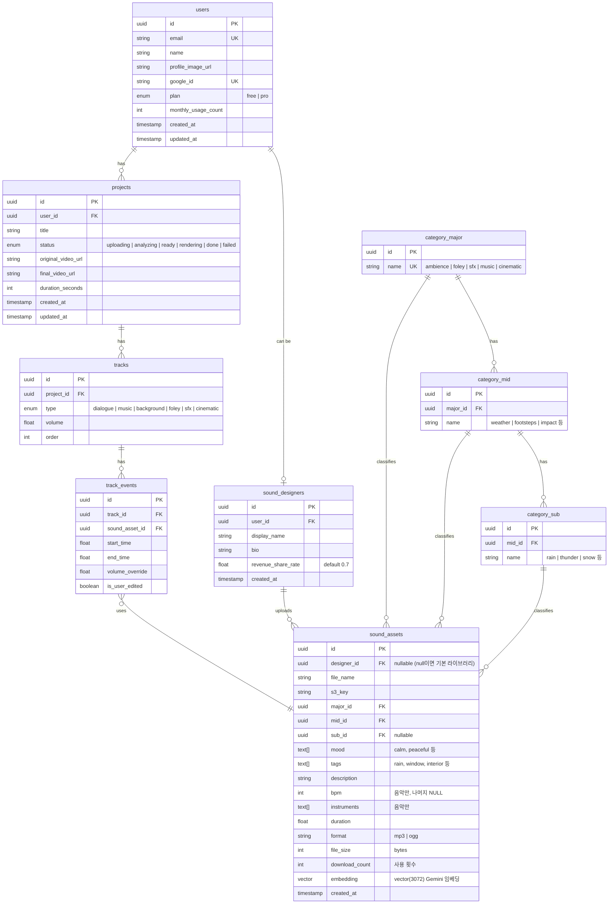

# ERD (Entity Relationship Diagram)

## 1. 테이블 구조 (Mermaid)

---

## 2. 테이블 설명

### users
사용자 계정 정보. Google OAuth로 가입/로그인 처리.

| 컬럼 | 타입 | 설명 |
|------|------|------|
| id | UUID | PK |
| email | VARCHAR | Google 계정 이메일 (unique) |
| name | VARCHAR | 표시 이름 |
| profile_image_url | VARCHAR | Google 프로필 이미지 URL |
| google_id | VARCHAR | Google 고유 ID (unique) |
| plan | ENUM | free / pro |
| monthly_usage_count | INT | 당월 프로젝트 생성 수 (무료 플랜 제한용) |
| created_at | TIMESTAMP | 가입일 |
| updated_at | TIMESTAMP | 정보 수정일 |

### projects
사용자가 생성한 영상 프로젝트.

| 컬럼 | 타입 | 설명 |
|------|------|------|
| id | UUID | PK |
| user_id | UUID | FK → users |
| title | VARCHAR | 프로젝트 이름 |
| status | ENUM | 처리 상태 (uploading → analyzing → ready → ...) |
| original_video_url | VARCHAR | 원본 영상 파일 경로 |
| final_video_url | VARCHAR | 최종 렌더링된 영상 파일 경로 |
| duration_seconds | INT | 영상 길이 (초) |

### tracks
프로젝트 내 6개 트랙. 프로젝트 생성 시 자동으로 6개 생성됨.

| 컬럼 | 타입 | 설명 |
|------|------|------|
| id | UUID | PK |
| project_id | UUID | FK → projects |
| type | ENUM | dialogue / music / background / foley / sfx / cinematic |
| volume | FLOAT | 트랙 전체 볼륨 (0.0 ~ 1.0) |
| order | INT | 에디터 표시 순서 |

### track_events
각 트랙에 배치된 효과음 이벤트 (AI 결과 + 사용자 편집 내용).

| 컬럼 | 타입 | 설명 |
|------|------|------|
| id | UUID | PK |
| track_id | UUID | FK → tracks |
| sound_asset_id | UUID | FK → sound_assets |
| start_time | FLOAT | 효과음 시작 시간 (초) |
| end_time | FLOAT | 효과음 종료 시간 (초) |
| volume_override | FLOAT | 이벤트 개별 볼륨 오버라이드 |
| is_user_edited | BOOLEAN | 사용자가 수동 편집했는지 여부 |

### category_major / category_mid / category_sub
효과음 3단계 분류 체계 (대분류 → 중분류 → 소분류).

| 테이블 | 컬럼 | 타입 | 설명 |
|--------|------|------|------|
| category_major | id | UUID | PK |
| | name | VARCHAR | 대분류 (ambience, foley, sfx, music, cinematic) |
| category_mid | id | UUID | PK |
| | major_id | UUID | FK → category_major |
| | name | VARCHAR | 중분류 (weather, footsteps, impact 등) |
| category_sub | id | UUID | PK |
| | mid_id | UUID | FK → category_mid |
| | name | VARCHAR | 소분류 (rain, thunder, snow 등) |

### sound_assets
효과음 파일 메타데이터. 기본 라이브러리 + 마켓플레이스 에셋 모두 포함.

| 컬럼 | 타입 | 설명 |
|------|------|------|
| id | UUID | PK |
| designer_id | UUID | FK → sound_designers (null이면 기본 라이브러리) |
| file_name | VARCHAR | 파일 이름 |
| s3_key | VARCHAR | S3 저장 경로 |
| major_id | UUID | FK → category_major (NOT NULL) |
| mid_id | UUID | FK → category_mid (NOT NULL) |
| sub_id | UUID | FK → category_sub (nullable) |
| mood | TEXT[] | 분위기 태그 (calm, peaceful 등) |
| tags | TEXT[] | 검색/매칭용 태그 (rain, window 등) |
| description | TEXT | 효과음 설명 |
| bpm | INT | BPM (음악만, 나머지 NULL) |
| instruments | TEXT[] | 악기 목록 (음악만) |
| duration | FLOAT | 효과음 길이 (초) |
| format | VARCHAR | 파일 포맷 (mp3, ogg) |
| file_size | INT | 파일 크기 (bytes) |
| download_count | INT | 사용 횟수 |
| embedding | VECTOR(3072) | Gemini 임베딩 벡터 |
| created_at | TIMESTAMP | 생성일 |

### sound_designers
효과음 마켓플레이스 판매자.

| 컬럼 | 타입 | 설명 |
|------|------|------|
| id | UUID | PK |
| user_id | UUID | FK → users |
| display_name | VARCHAR | 판매자 표시 이름 |
| bio | TEXT | 소개 |
| revenue_share_rate | FLOAT | 수익 배분율 (기본 0.7 = 70%) |

---

## 3. 주요 설계 결정

- **UUID 사용**: 순차 ID 대신 UUID를 사용하여 예측 불가능한 ID 보장
- **soft delete 미적용**: 초기 MVP에서는 하드 삭제 사용
- **sound_assets의 designer_id nullable**: 기본 라이브러리(null)와 마켓플레이스 에셋을 동일 테이블로 관리
- **track_events의 is_user_edited**: AI 결과와 사용자 편집 내역을 구분하여 추후 AI 개선 데이터로 활용 가능
